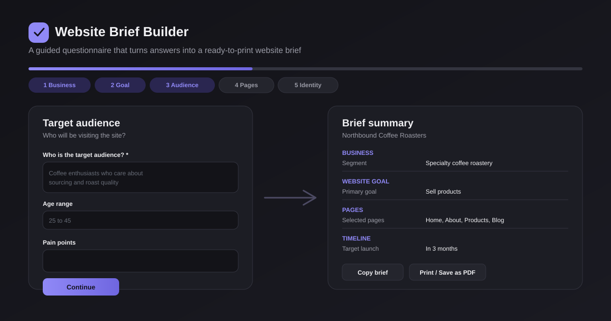

# Website Brief Builder



A guided, visual questionnaire that walks a person through defining a website brief: business, goals, audience, pages, identity, features, references, and timeline. Answers turn into a clean summary that can be copied as text or printed as a PDF. Built as a portfolio piece: fully client-side, no accounts, and no real data.

## Features

- Eight-step guided flow: business, goal, audience, pages, visual identity, features, references, and timeline
- Progress bar with a scrollable step tracker; jump back to any completed step, on mobile too
- Text fields, single-select cards, multi-select chips, and a feature-priority picker (nice to have / important / must have)
- Demonstrative budget range selector, clearly illustrative, not a real quote
- Per-step validation with specific inline error messages and required-field indicators
- Save the current answers as a draft in `localStorage` at any time, with visual and toast feedback
- Resume a previously saved draft from where it left off, or clear it entirely
- One-click sample data to preview the whole flow with a fictional business
- Final summary screen, organized by section, with quick "Edit" links back into each step
- Copy the full brief as plain text to the clipboard
- Print or save the brief as a PDF using the browser's native print dialog, with a print-only layout
- Start a new briefing at any time (confirms before discarding a saved draft)
- Light and dark theme, persisted and applied before first paint
- Fully responsive layout and keyboard navigation, from mobile to desktop
- Accessible modals: focus trap, `Escape` to close, focus restored on close, visible focus outlines

## Tech Stack

- [Next.js](https://nextjs.org) (App Router)
- [React](https://react.dev)
- [TypeScript](https://www.typescriptlang.org)
- [Tailwind CSS v4](https://tailwindcss.com)
- [lucide-react](https://lucide.dev) for icons

## How It Works

The app walks through eight steps in a fixed order. Each step validates its own required fields before allowing the user to continue; errors are shown inline, next to the field that needs attention. Progress can be reviewed at any time from the step tracker at the top: steps already completed are reachable, steps not yet reached are locked.

After the last step, the app shows a single-page summary of every answer, grouped by section, each with a shortcut back to that step for edits.

## Data & Storage

All answers and the theme preference are stored only in the browser's `localStorage`, under the `website-brief-builder:draft` and `website-brief-builder:theme` keys. There is no database, no authentication, no external API, and no AI service involved.

- The draft autosaves as answers change, and can also be saved on demand from the "Save draft" button.
- On the start screen, a saved draft shows its current step and last-updated time, and can be resumed or cleared.
- If the browser blocks or fills up storage (for example in private browsing), the app shows a toast instead of failing silently.
- The optional sample-data button fills the form with a fictional business for demo purposes only; nothing in this project represents a real client, company, or contact.

## Printing the Brief

From the final summary screen, use "Print / Save as PDF" to open the browser's print dialog. The print stylesheet hides all navigation, buttons, and edit links, leaving only the briefing content and a title with the business name, formatted for a clean printed page or PDF export.

## Getting Started

Install dependencies and run the development server:

```bash
npm install
npm run dev
```

Open [http://localhost:3000](http://localhost:3000) to view the app.

## Available Scripts

- `npm run dev`: start the development server
- `npm run build`: create a production build
- `npm run start`: run the production build
- `npm run lint`: run ESLint

## Project Structure

```
src/
  app/              App Router entry point, global styles, root layout
  components/       Wizard shell, progress bar, summary view, toast, and step components
    fields/         Reusable form controls (text field, select cards, chips, priority picker)
    steps/          One component per briefing step
  hooks/            Draft persistence, theme, toast, and modal accessibility hooks
  lib/              Types, option lists, validation, storage, sanitize, and summary-text builder
public/
  preview.svg       Preview image used in this README
```

## Notes

- All sample data is fictional and only used to preview the flow; nothing represents a real person, business, or brand.

## License

Licensed under the [MIT License](LICENSE).
